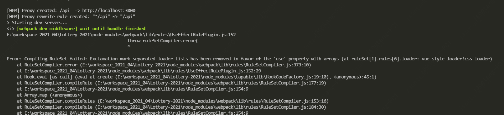
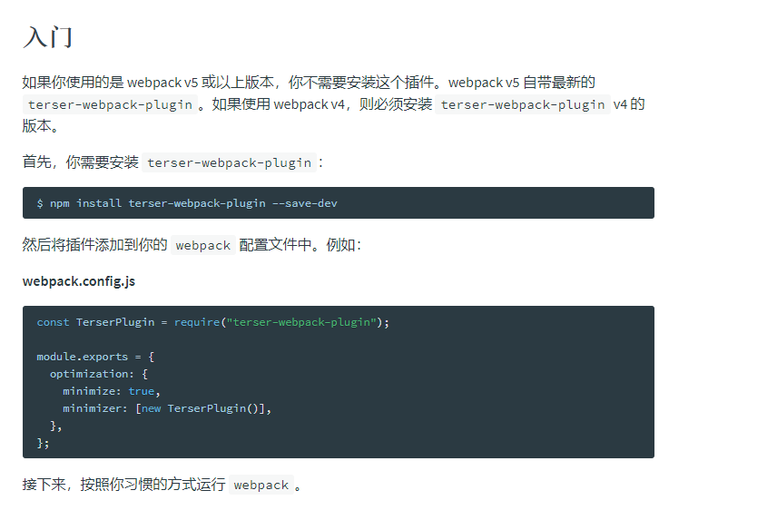
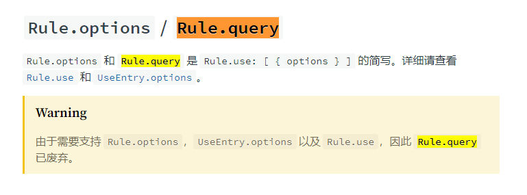
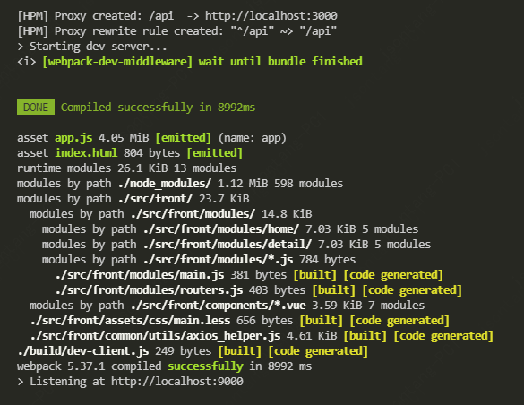

# Webpack 4 迁移到 Webpack 5 不完全指南

周末，突发奇想，研究一下彩票，本来是搞彩票历史数据的，最后变成了Webpack升级专场。气不过来，决定记录一下。

### 一、起因

因为要研究彩票历史数据，决定新建一个项目，然后就拉了之前的脚手架，结果Install的时候把Webpack升级到了最新版本，也就是Webpack5，然后就跑不起来，一直在改，周末的美好时光就浪费在这个东西上了。

### 二、迁移Webpack遇到的问题

#### 1、 webpack-merge

这个包有点像Object.asign,主要是Merge对象，旧版本是这样的：

    const merge = require('webpack-merge');

升级到`"webpack-merge": "^5.7.3"`后，应该这样写：

    const { merge } = require('webpack-merge');

#### 2、 webpack-md5-hash 插件

这个插件是用来生成Md5哈希串的，但是在新版本里已经不需要了，直接用 `[fullhash]/[chunkhash]/[contenthash]`中的一个就行。

#### 3、 optimization -> splitChunks

这个分包的配置中，没有`name`属性，所以去掉。下面是一个官方的示例：

```json
module.exports = {
  //...
  optimization: {
    splitChunks: {
      chunks: 'async',
      minSize: 20000,
      minRemainingSize: 0,
      minChunks: 1,
      maxAsyncRequests: 30,
      maxInitialRequests: 30,
      enforceSizeThreshold: 50000,
      cacheGroups: {
        defaultVendors: {
          test: /[\\/]node_modules[\\/]/,
          priority: -10,
          reuseExistingChunk: true,
        },
        default: {
          minChunks: 2,
          priority: -20,
          reuseExistingChunk: true,
        },
      },
    },
  },
};
```

#### 4、关于Loaders

在Webpack5中，没有Loaders的这个配置了，针对每个规则，可以通过Use来引用loader.比如，原先我的项目是这样配置 ：

```json
{
    rules: [
         {
            test: /\.(c|le)ss$/,
            loader: ['style-loader', ...]
        }
    ]
}

```
然后就会报这种错：



意思就是让你把它换成Use， 所有升级之后，则变成：

```json
{
    rules: [
         {
            test: /\.(c|le)ss$/,
            use: ['style-loader', ...]
        }
    ]
}

```
#### 5、关于VueLoaderPlugin

因为项目老的脚手架是用的Vue写的，升级了vue-loader之后会报另一个错：

    vue-loader was used without the corresponding plugin. Make sure to include VueLoaderPlugin in your webpack config.

这个是啥意思呢，就是在升级到 `"vue-loader": "^15.9.7",`之后，都需要把VueLoaderPlugin把入到Webpakc配置中去，很直白了，所以改掉。

```json
    plugins: [
        ...
        new VueLoaderPlugin()
    ],
```

#### 6、devtool

本地调试都会用到Devtool，老版本的配置是这样的：

    // cheap-module-eval-source-map is faster for development
    devtool: '#cheap-module-eval-source-map',

然后还有个官方的注释说这个是最快的，呵呵，结果就是跑不起来，一开始我还不知道是这里报错，一行一行注释对发现的，原因也是很直白，因为它换了个名称：

    devtool: 'eval-cheap-module-source-map',

现在它叫这个名字了，哈哈，好气啊。而且不需要前面加#号。更多可选配置请参考[devtool 官方文档](https://webpack.docschina.org/configuration/devtool/#root)

#### 7、http-proxy-middleware
关于Http代理中间件，因为新版本的原因，原先是`"http-proxy-middleware": "^0.20.0-beta.2",`,现在是`"http-proxy-middleware": "^2.0.0",`。相应地，引用方式也发生了改变，由原来的：

```javascript
    let proxyMiddleware = require('http-proxy-middleware')
```

改为：

```javascript
    let { createProxyMiddleware } = require('http-proxy-middleware')
```

#### 8、 compilation钩子

再有一个就是关于 `Compilation`钩子的，Compilation 类扩展(extend)自 Tapable，并提供了生命周期钩子。所以原先老版本，是这样来做Reload的：

```javascript
    compiler.plugin('compilation', function (compilation) {
        compilation.plugin('html-webpack-plugin-after-emit', function (data, cb) {
            hotMiddleware.publish({ action: 'reload' }) // 假定hotMiddleware已定义
        })
    })
```
在Webpack5中这一段其实可以直接注释掉，因为热更新模块本身就会reload

#### 9、 terser-webpack-plugin
在`webpack 4` 中用户需要安装这个插件来压缩`javascript`, 但是在`webpack 5 `中自带最新的 `terser-webpack-plugin`所以你不需要再安装啦



#### 10、 rule.query
`webapck 4`中，配置规则可以用query，就像下面这样：

```javascript
    {
      test: /\.(woff2?|eot|ttf|otf)(\?.*)?$/,
      loader: 'file-loader',
      query: {
        limit: 10000,
        name: utils.assetsPath('fonts/[name].[hash:7].[ext]'),
        publicPath: '/',
      }
    },

```
然后升级就会报错，原因是因为在新版本中已经不支持这个配置了：



所以，应当改成下面这样：

```javascript
    {
      test: /\.(woff2?|eot|ttf|otf)(\?.*)?$/,
      loader: 'file-loader',
      options: {
        limit: 10000,
        name: utils.assetsPath('fonts/[name].[chunkhash].[ext]'),
        publicPath: '/',
      }
    },

```
这样就行了，换了个写法，其实这里面是一个大的改动，有兴趣可以去官方文档看看。


### 三、最后

经过一番调试，终于见到了久违的界面(其实还升级了Babel，这里就不主要讲了)：




想要源码的可以到github.com上去看: [LOTTERY-2021](https://github.com/uct8086/Lottery-2021)

最后祝我中大奖 ~ 欢迎 star 

